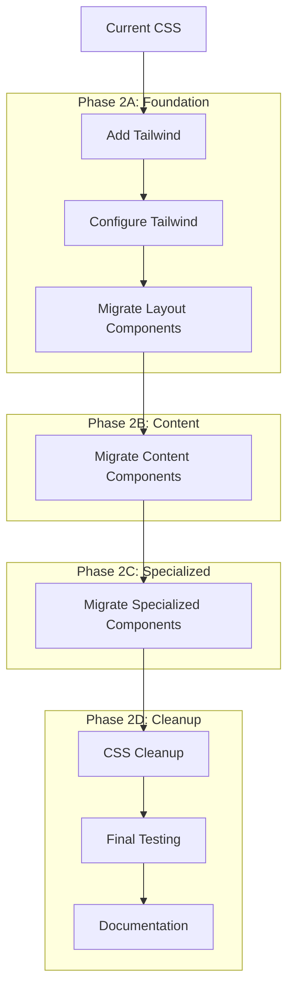

# Tailwind CSS Integration Plan for Paper Recommender

## Current State Analysis

### Existing UI Structure
- **HTML**: Well-organized with separate views for different functionality
- **CSS**: Custom styling (~800 lines) with a consistent design system
- **JavaScript**: Modular architecture with three files (components.js, core.js, views.js)
- **Progress Indicator**: Already implemented with some Tailwind-like utility classes

### Key Observations
1. The project already uses utility classes similar to Tailwind (flex, items-center, etc.)
2. The CSS includes custom variables for colors, spacing, and other design tokens
3. The UI has a consistent design language that can be enhanced
4. The JavaScript interacts with CSS classes for functionality (e.g., 'hidden' class)

## Tailwind CSS Integration Strategy

### 1. Setup and Configuration

#### Add Tailwind CSS to the Project
```html
<!-- Add to head section of index.html -->
<link href="https://cdn.jsdelivr.net/npm/tailwindcss@2.2.19/dist/tailwind.min.css" rel="stylesheet">
<!-- Keep the original CSS for backward compatibility during migration -->
<link rel="stylesheet" href="css/styles.css">
```

#### Create Tailwind Configuration
Create a `tailwind.config.js` file to customize Tailwind with a modern design system:

```javascript
module.exports = {
  theme: {
    extend: {
      colors: {
        // Modern color palette
        primary: {
          50: '#e3f2fd',
          100: '#bbdefb',
          200: '#90caf9',
          300: '#64b5f6',
          400: '#42a5f5',
          500: '#2196f3',  // Primary color
          600: '#1e88e5',
          700: '#1976d2',
          800: '#1565c0',
          900: '#0d47a1',
        },
        secondary: {
          50: '#e8eaf6',
          100: '#c5cae9',
          200: '#9fa8da',
          300: '#7986cb',
          400: '#5c6bc0',
          500: '#3f51b5',  // Secondary color
          600: '#3949ab',
          700: '#303f9f',
          800: '#283593',
          900: '#1a237e',
        },
        success: {
          500: '#4caf50',
        },
        warning: {
          500: '#ff9800',
        },
        danger: {
          500: '#f44336',
        },
        gray: {
          50: '#fafafa',
          100: '#f5f5f5',
          200: '#eeeeee',
          300: '#e0e0e0',
          400: '#bdbdbd',
          500: '#9e9e9e',
          600: '#757575',
          700: '#616161',
          800: '#424242',
          900: '#212121',
        },
      },
      boxShadow: {
        sm: '0 1px 2px 0 rgba(0, 0, 0, 0.05)',
        DEFAULT: '0 1px 3px 0 rgba(0, 0, 0, 0.1), 0 1px 2px 0 rgba(0, 0, 0, 0.06)',
        md: '0 4px 6px -1px rgba(0, 0, 0, 0.1), 0 2px 4px -1px rgba(0, 0, 0, 0.06)',
        lg: '0 10px 15px -3px rgba(0, 0, 0, 0.1), 0 4px 6px -2px rgba(0, 0, 0, 0.05)',
        xl: '0 20px 25px -5px rgba(0, 0, 0, 0.1), 0 10px 10px -5px rgba(0, 0, 0, 0.04)',
      },
      borderRadius: {
        'sm': '0.125rem',
        DEFAULT: '0.25rem',
        'md': '0.375rem',
        'lg': '0.5rem',
        'xl': '0.75rem',
        '2xl': '1rem',
      },
      typography: {
        DEFAULT: {
          css: {
            maxWidth: '65ch',
            color: 'var(--tw-prose-body)',
            lineHeight: '1.75',
          },
        },
      },
    },
  },
  variants: {
    extend: {
      opacity: ['disabled'],
      backgroundColor: ['active'],
      textColor: ['active'],
    },
  },
  plugins: [
    require('@tailwindcss/typography'),
    require('@tailwindcss/forms'),
  ],
}
```

### 2. Incremental Migration Approach

A component-by-component migration approach:

1. **Start with Layout Components**: Navigation, footer, and container
2. **Move to Content Components**: Cards, paper items, forms
3. **Finally, Update Specialized Components**: Progress indicators, visualizations

For each component:
1. Identify the custom CSS rules
2. Find equivalent Tailwind utility classes
3. Update HTML with Tailwind classes
4. Test functionality
5. Remove redundant custom CSS

### 3. Design Language Improvements

#### Color System
- Implement a more sophisticated color palette with proper light/dark variants
- Use semantic color naming (primary, secondary, etc.) with numeric scales (100-900)
- Improve contrast ratios for better accessibility

#### Typography
- Implement a more consistent typographic scale
- Use appropriate font weights for different text elements
- Improve line heights and letter spacing for better readability

#### Spacing and Layout
- Use a consistent spacing scale based on Tailwind's default (0.25rem increments)
- Implement more sophisticated grid layouts using Tailwind's grid utilities
- Improve responsive behavior with better breakpoint usage

#### Component Design
- Enhance cards with more subtle shadows and hover effects
- Improve form elements with better focus states and validation styling
- Add micro-interactions through transitions and transforms

### 4. Detailed Migration Plan

#### Phase 2A: Layout Components

##### Navigation Bar
```html
<!-- Before -->
<nav>
  <div class="container">
    <ul>
      <li><a href="#" data-view="home" class="active">Home</a></li>
      <!-- other nav items -->
    </ul>
  </div>
</nav>

<!-- After -->
<nav class="fixed top-0 left-0 w-full bg-secondary-800 py-2 px-4 z-50 shadow-md">
  <div class="max-w-6xl mx-auto px-5">
    <ul class="flex">
      <li class="mr-4">
        <a href="#" data-view="home" class="text-white py-2 px-3 rounded hover:bg-secondary-700 transition-colors duration-300 active:bg-secondary-600 focus:outline-none focus:ring-2 focus:ring-primary-300">Home</a>
      </li>
      <!-- other nav items with Tailwind classes -->
    </ul>
  </div>
</nav>
```

##### Container
```html
<!-- Before -->
<div class="container">
  <!-- content -->
</div>

<!-- After -->
<div class="max-w-6xl mx-auto px-5">
  <!-- content -->
</div>
```

##### Footer
```html
<!-- Before -->
<footer>
  <!-- Progress Indicator -->
  <div id="progress-footer" class="hidden">
    <!-- progress content -->
  </div>
  
  <!-- Copyright Information -->
  <div class="container">
    <p>Paper Recommender by Qin Juehang</p>
  </div>
</footer>

<!-- After -->
<footer class="fixed bottom-0 left-0 w-full bg-secondary-800 text-white text-center py-4 z-50 shadow-lg">
  <!-- Progress Indicator -->
  <div id="progress-footer" class="hidden">
    <!-- progress content with Tailwind classes -->
  </div>
  
  <!-- Copyright Information -->
  <div class="max-w-6xl mx-auto px-5">
    <p class="text-gray-200">Paper Recommender by Qin Juehang</p>
  </div>
</footer>
```

#### Phase 2B: Content Components

##### Cards
```html
<!-- Before -->
<div class="card">
  <div class="card-header">
    <h2>Card Title</h2>
  </div>
  <div class="card-body">
    <!-- content -->
  </div>
</div>

<!-- After -->
<div class="bg-white rounded-lg shadow-md hover:shadow-lg transition-shadow duration-300 overflow-hidden">
  <div class="bg-primary-600 text-white p-4">
    <h2 class="text-xl font-semibold">Card Title</h2>
  </div>
  <div class="p-6">
    <!-- content -->
  </div>
</div>
```

##### Paper Cards
```html
<!-- Before -->
<div class="paper-card">
  <h3 class="paper-title">Paper Title</h3>
  <!-- other content -->
</div>

<!-- After -->
<div class="border border-gray-300 rounded-lg p-6 mb-6 bg-white shadow-md hover:shadow-lg transition-shadow duration-300">
  <h3 class="text-lg font-semibold mb-2 text-secondary-700">Paper Title</h3>
  <!-- other content with Tailwind classes -->
</div>
```

##### Forms
```html
<!-- Before -->
<div class="form-group">
  <label for="input-id">Label</label>
  <input type="text" id="input-id">
</div>

<!-- After -->
<div class="mb-4">
  <label for="input-id" class="block mb-2 font-medium text-gray-700">Label</label>
  <input type="text" id="input-id" class="w-full p-2 border border-gray-300 rounded-md focus:ring-2 focus:ring-primary-500 focus:border-primary-500 transition-colors duration-200">
</div>
```

#### Phase 2C: Specialized Components

##### Progress Indicator
The progress indicator already uses some Tailwind-like classes. We'll update it to use full Tailwind:

```html
<!-- Before -->
<div id="progress-footer" class="hidden">
  <div class="container flex items-center">
    <div id="progress-icon" class="mr-3 w-6 h-6 flex items-center justify-center">
      <!-- icon -->
    </div>
    <div id="progress-text" class="flex-grow text-sm text-gray-600">
      <!-- text -->
    </div>
    <div id="progress-bar-container" class="w-1/3 bg-gray-300 h-1 rounded-full">
      <div id="progress-bar" class="bg-blue-500 h-1 rounded-full" style="width: 0%"></div>
    </div>
  </div>
</div>

<!-- After -->
<div id="progress-footer" class="hidden bg-white bg-opacity-95 border-t border-gray-200 transition-all duration-300 py-3">
  <div class="max-w-6xl mx-auto px-5 flex items-center">
    <div id="progress-icon" class="mr-3 w-6 h-6 flex items-center justify-center flex-shrink-0">
      <!-- icon -->
    </div>
    <div id="progress-text" class="flex-grow text-sm text-gray-700 mr-4 font-medium">
      <!-- text -->
    </div>
    <div id="progress-bar-container" class="w-1/3 bg-gray-200 h-1.5 rounded-full flex-shrink-0 overflow-hidden">
      <div id="progress-bar" class="bg-primary-600 h-1.5 rounded-full transition-all duration-300" style="width: 0%"></div>
    </div>
  </div>
</div>
```

##### Buttons
```html
<!-- Before -->
<button class="btn">Button</button>
<button class="btn btn-primary">Primary Button</button>

<!-- After -->
<button class="inline-block bg-primary-600 text-white py-2 px-4 rounded-md hover:bg-primary-700 focus:outline-none focus:ring-2 focus:ring-primary-500 focus:ring-opacity-50 transition-colors duration-300">Button</button>
<button class="inline-block bg-primary-600 text-white py-2 px-4 rounded-md hover:bg-primary-700 focus:outline-none focus:ring-2 focus:ring-primary-500 focus:ring-opacity-50 transition-colors duration-300">Primary Button</button>
```

### 5. JavaScript Compatibility

To maintain compatibility with JavaScript functionality:

1. **Keep Critical Class Names**: Preserve class names used in JavaScript selectors (e.g., 'hidden', 'active')
2. **Update Class References**: If class names change, update JavaScript references
3. **Use Data Attributes**: For functionality-specific selectors, prefer data attributes over classes

Example:
```javascript
// Before
element.classList.add('hidden');

// After (no change needed as we'll keep the 'hidden' class)
element.classList.add('hidden');
```

### 6. CSS Cleanup Strategy

As components are migrated to Tailwind:

1. Move migrated CSS rules to a separate file (e.g., `legacy-styles.css`)
2. Gradually reduce the size of this file as more components are migrated
3. Eventually remove the legacy CSS file when migration is complete

### 7. Testing Strategy

For each component migration:

1. **Visual Testing**: Compare before/after appearance
2. **Functional Testing**: Verify all interactions still work
3. **Responsive Testing**: Test on multiple screen sizes
4. **Cross-Browser Testing**: Verify in Chrome, Firefox, Safari

### 8. Implementation Phases

#### Phase 2A: Foundation
- Add Tailwind CSS to the project
- Create configuration file
- Migrate layout components (navigation, container, footer)
- Test and verify layout functionality

#### Phase 2B: Content Components
- Migrate cards and paper items
- Update form elements
- Migrate buttons and common UI elements
- Test and verify component functionality

#### Phase 2C: Specialized Components
- Migrate progress indicators
- Update visualization components
- Migrate remaining specialized UI elements
- Test and verify all functionality

#### Phase 2D: Cleanup
- Remove redundant CSS
- Optimize Tailwind configuration
- Final testing and verification
- Documentation update

## Mermaid Diagram: Migration Strategy



## Potential Challenges and Mitigations

1. **JavaScript Compatibility**
   - **Challenge**: Changing class names might break JavaScript functionality
   - **Mitigation**: Preserve critical class names, use data attributes for selectors

2. **CSS Specificity Conflicts**
   - **Challenge**: Tailwind classes might conflict with existing CSS
   - **Mitigation**: Use Tailwind's `!important` modifier when needed, gradually remove conflicting CSS

3. **Maintaining Consistent Design**
   - **Challenge**: Ensuring consistent appearance during migration
   - **Mitigation**: Create a design token mapping between custom CSS and Tailwind

4. **Performance Impact**
   - **Challenge**: Tailwind might increase CSS size
   - **Mitigation**: Use Tailwind's purge option to remove unused styles in production

## Next Steps

1. Set up Tailwind CSS in the project
2. Create a custom configuration file
3. Begin migrating layout components
4. Test and iterate